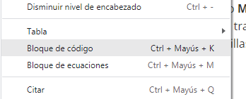
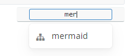
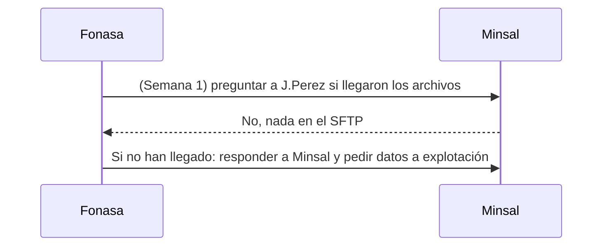
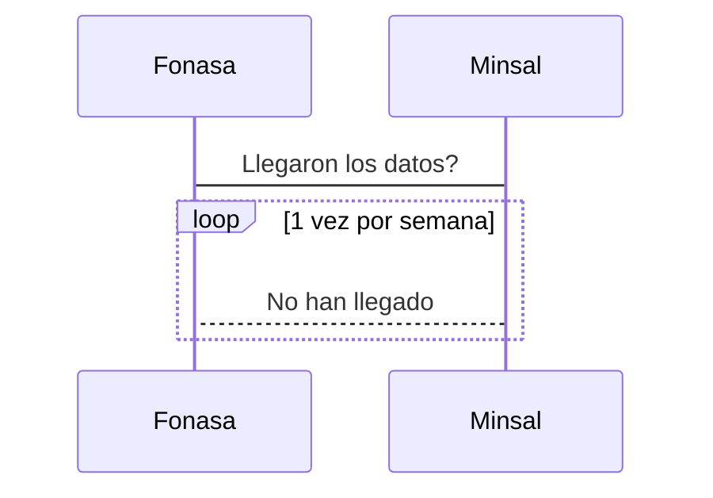
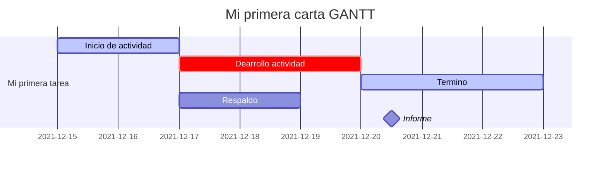
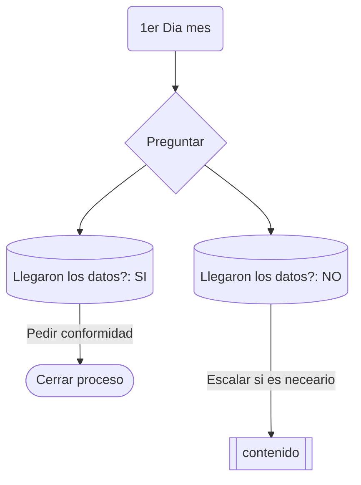
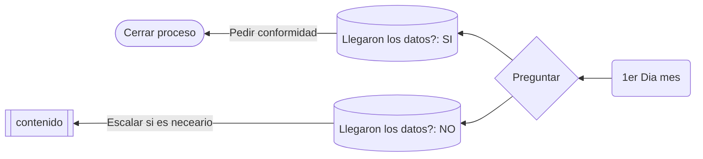

# Ejemplos mermaid

> **Estos diagramas se actualmente no se visualizan en `github.com`, pero dicen que se verán. De momento si se pueden ver en los documentos y en cuando se exporta a PDF.**

Para comenzar un diagrama **Mermaid** basta con insertar un bloque de código e indicar que es de tipo **Mermaid**. Este tipo de herramienta permite poca configuración ya que transforma un texto e interpreta el diagrama y por eso está bien para cosas sencillas.



Luego indicar el tipo de código.



En este link [https://mermaid-js.github.io/](https://mermaid-js.github.io/mermaid/) están todos los ejemplos en inglés, pero es solo seguir el código.

## Secuencias

Estos diagramas son interesante para diagramar  intercambio de información entre personas o instituciones.

```
sequenceDiagram
	Participant Fonasa
	Participant Minsal
	Fonasa ->> Minsal: (Semana 1) preguntar a J.Perez si llegaron los archivos
	Minsal -->> Fonasa: No, nada en el SFTP
        Fonasa ->> Minsal: Si no han llegado: responder a Minsal y pedir datos a explotación
```

Este diagrama se traduce en 



Se podría hacer un loop preguntando si llegaron los datos y en lugar de participante indicar actor.

```
sequenceDiagram
	Fonasa -> Minsal: Llegaron los datos?
	loop 1 vez por semana
		Minsal --> Fonasa: No han llegado
	end
```



## Carta Gantt

Estas son un poco mas complejas de armar, pero son intuitivas.

```
gantt
	dateFormat 	DD-MM-YYYY
	title 		Mi primera carta GANTT
	
	section Mi primera tarea
	Inicio de actividad        :active, des1, 15-12-2021, 2d
	Dearrollo actividad        :crit, des2, after des1, 3d
	Termino                    :active, des3, after des2, 3d
	Respaldo                   :after des1, 2d
	Informe                    :milestone, after des2, 1d
```




## Diagrama de flujo

Quizás las más útiles

La orientación puede ser:

- TB - top to bottom
- TD - top-down/ same as top to bottom
- BT - bottom to top
- RL - right to left
- LR - left to right

Hay varios tipos de cuadros según el delimitador por ejemplo... hay mas...

- `(contenido)`
- `([contenido])`
- `[[contenido]]`
- `[(contenido)]`
- `((contenido))`
- `>contenido]`
- `{contenido}`

```
graph TB
	A(1er Dia mes) --> B{Preguntar}
	B --> C[(Llegaron los datos?: SI)]
	B --> D[(Llegaron los datos?: NO)]
	C -->|Pedir conformidad| E([Cerrar proceso])
	D --->|Escalar si es neceario| F[[contenido]]
```




O de derecha a izquierda



> Son muchísimas las opciones
>
> https://mermaid-js.github.io/mermaid/#/flowchart


