## Evolución población beneficiaria Fonasa

**Archivos para el PMG de Género 2021**  
Departamento de Estudios y Estadísticas  
División de Desarrollo Institucional  
FONASA 2021© [^1]

----

## Archivos de datos

[data2Fonasa](./data2Fonasa.xlsx)   
[data2Isapres](./data2Isapres.xlsx)   
[dataPersonas](./dataPersonas.xlsx)   

---

## Archivos gráficos

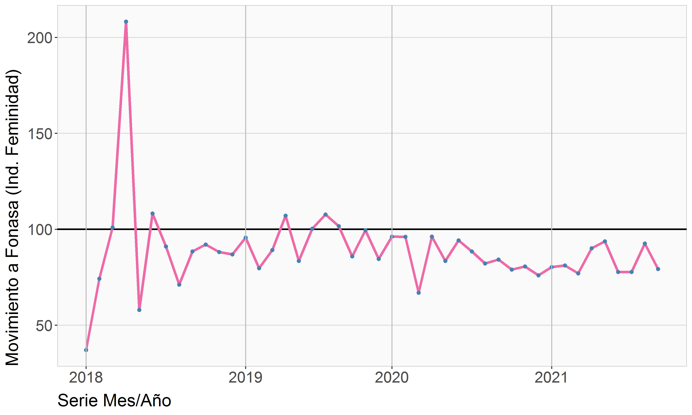
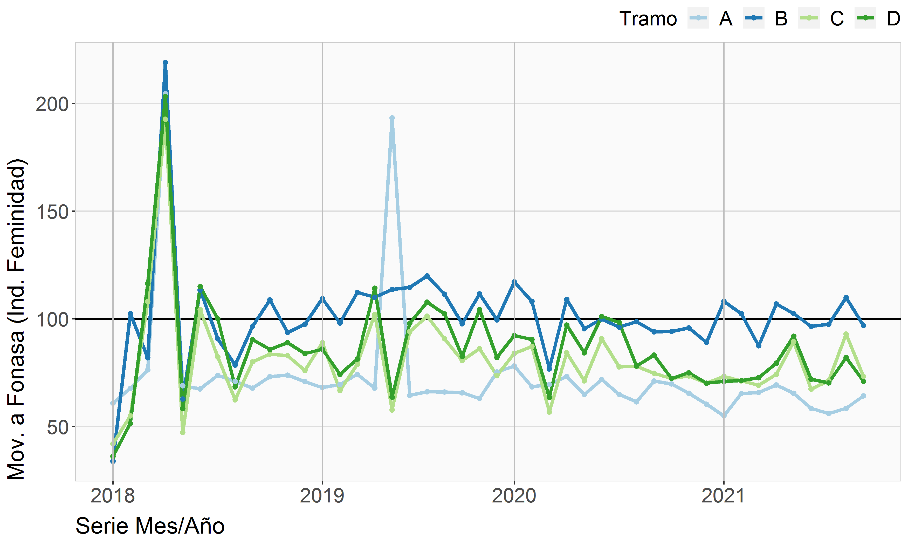
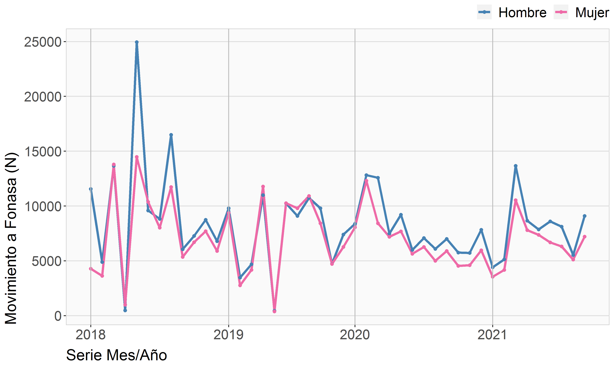
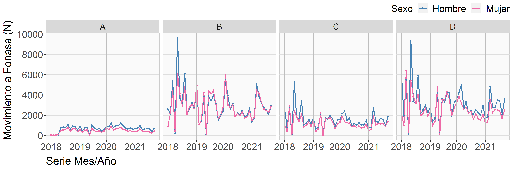
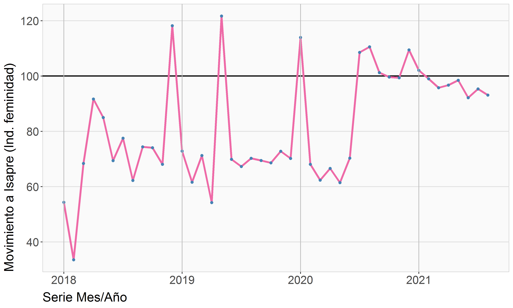
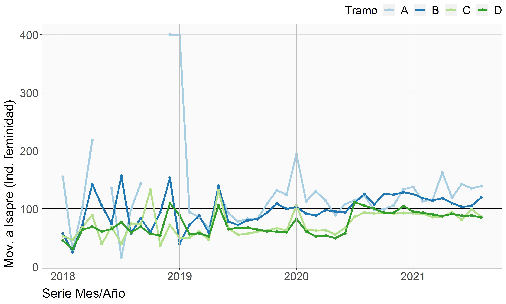
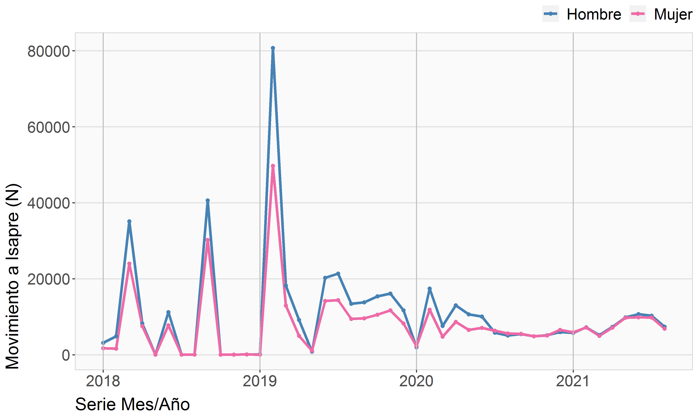
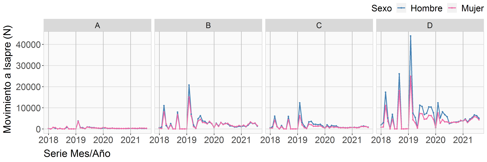
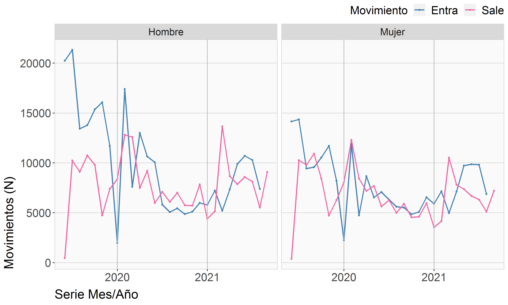
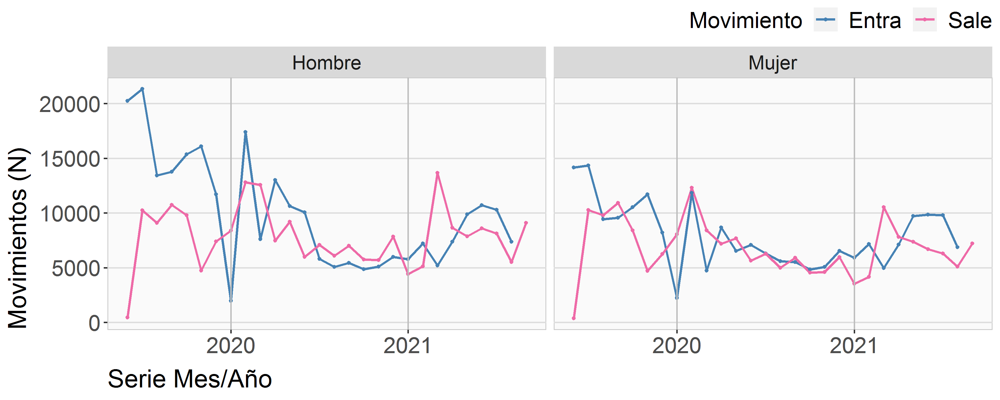
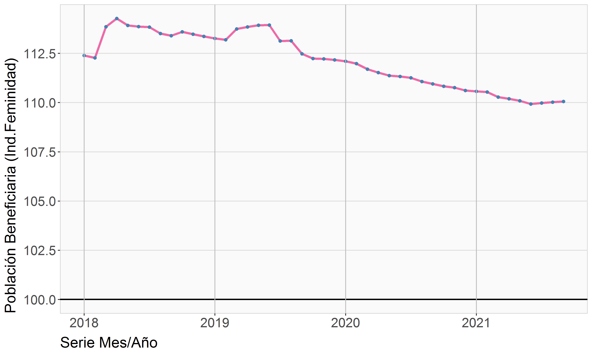
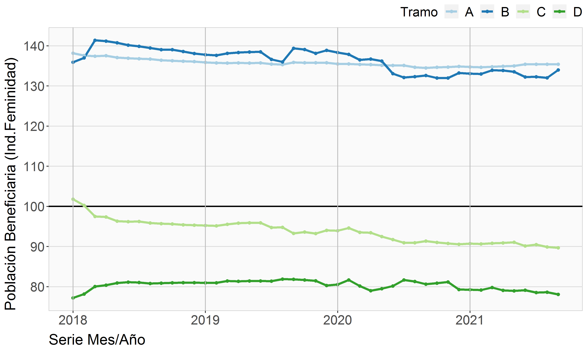
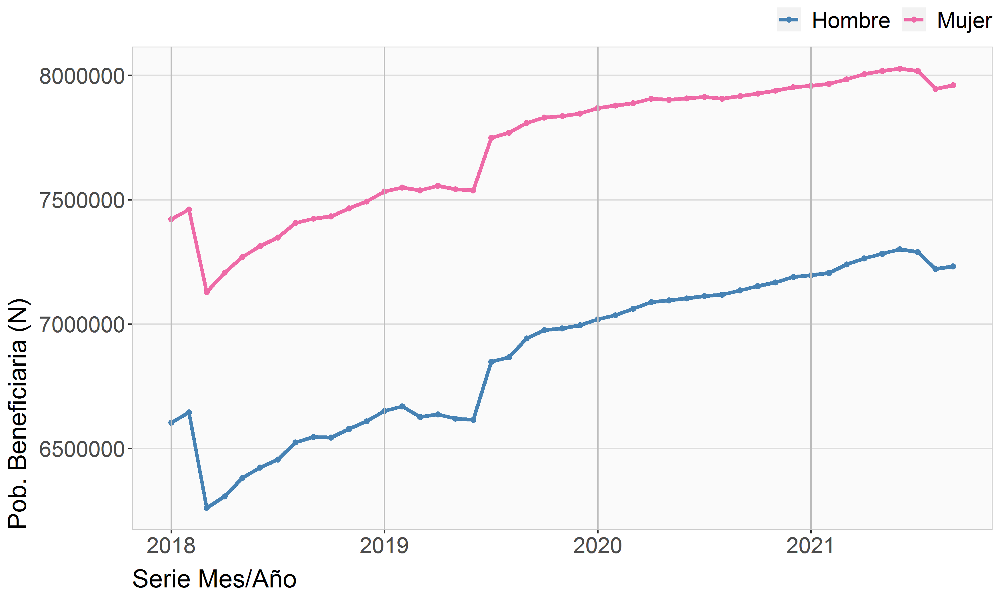
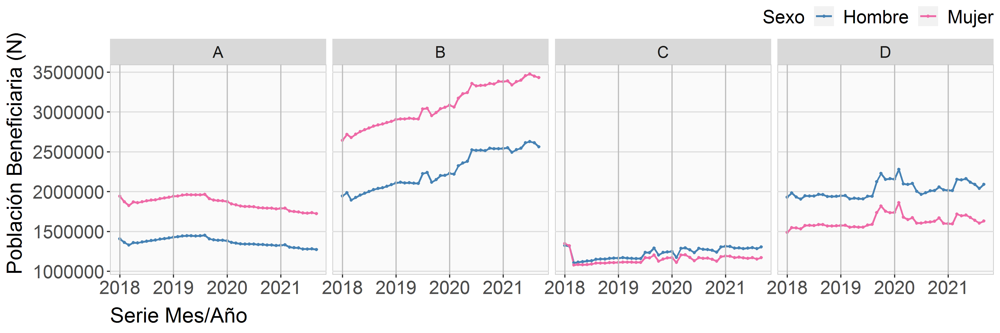

---

[^1]: Elaborado por Oliver Rojas Bustamante, orojas@fonasa.cl
