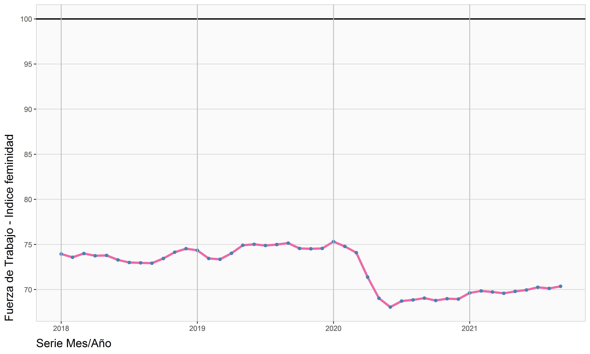
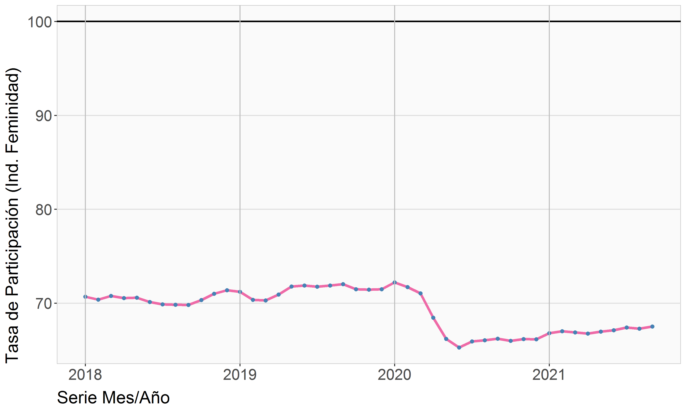

## Situación laboral, Cotizaciones y Renta

**Archivos para el PMG de Género 2021**  
Departamento de Estudios y Estadísticas  
División de Desarrollo Institucional  
FONASA 2021© [^1]

----

## Archivos de datos

[dataCot](./dataCot.xlsx)   
[dataDes](./dataDes.xlsx)   
[dataTitu](./dataTitu.xlsx)   
[indicadores_principales a 09-2021](./indicadores_principales a 09-2021.xlsx)   

---

## Archivos gráficos

---

[^1]: Elaborado por Oliver Rojas Bustamante, orojas@fonasa.cl
