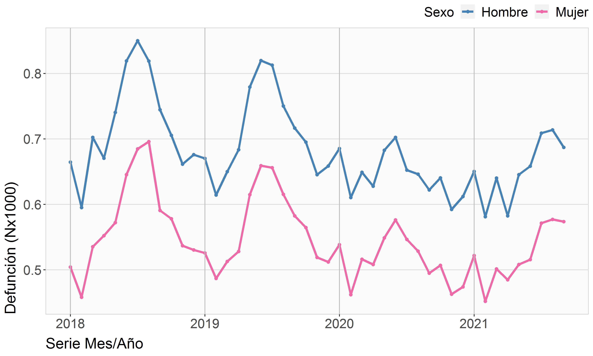
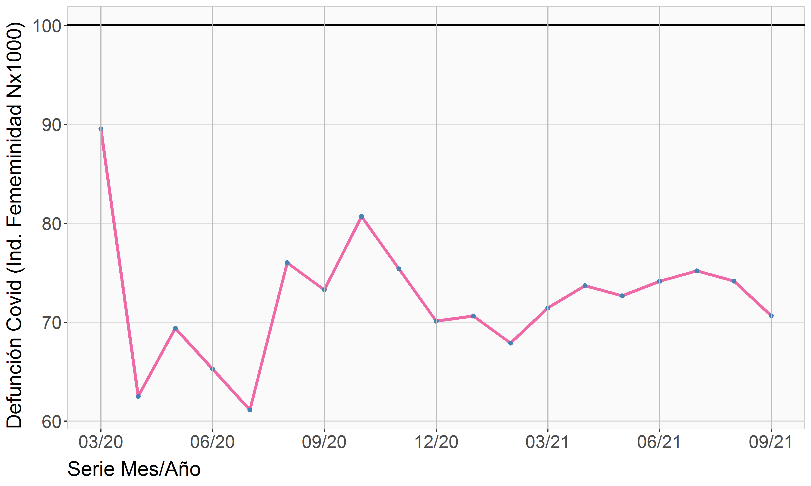
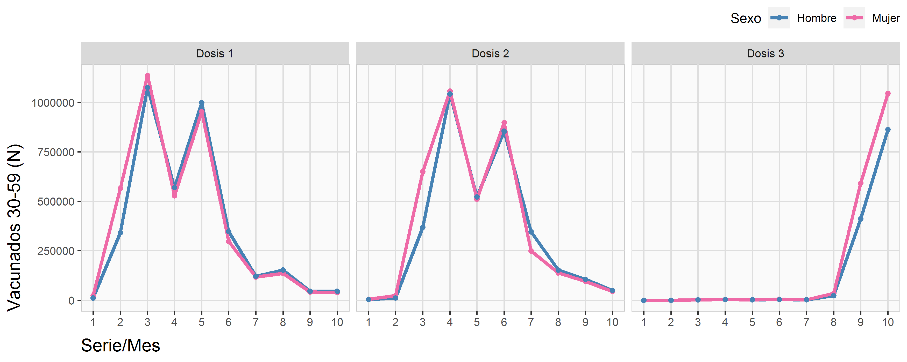

## Contagio, Hospitalizacion, Fallecidos y Vacuna

**Archivos para el PMG de Género 2021**  
Departamento de Estudios y Estadísticas  
División de Desarrollo Institucional  
FONASA 2021© [^1]

----

## Archivos de datos

[dataCovid](./dataCovid.xlsx)   
[dataDefuncion](./dataDefuncion.xlsx)   
[dataEgreso](./dataEgreso.xlsx)   
[edad1](./edad1.xlsx)   
[edad2](./edad2.xlsx)   
[edad3](./edad3.xlsx)   
[mas110yr](./mas110yr.xlsx)   

---

## Archivos gráficos

---

[^1]: Elaborado por Oliver Rojas Bustamante, orojas@fonasa.cl
