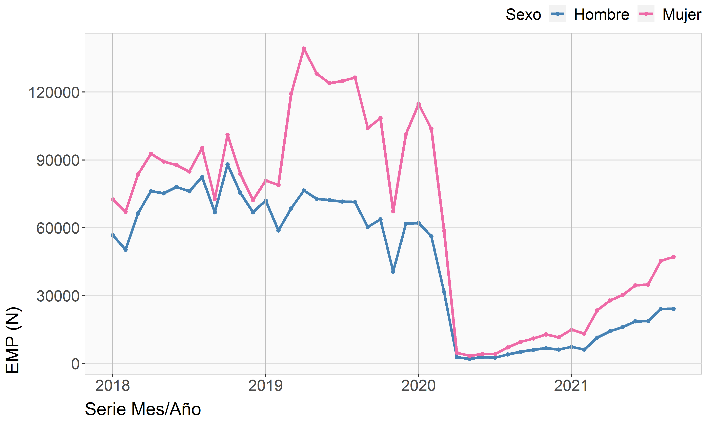
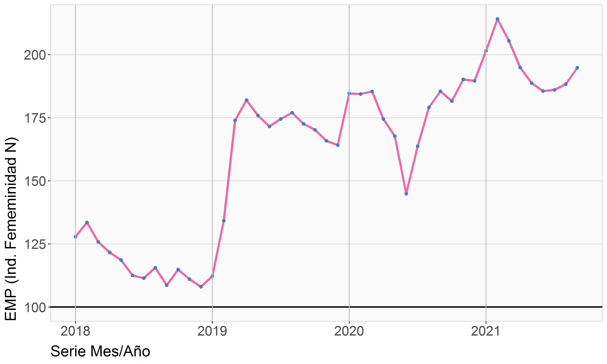
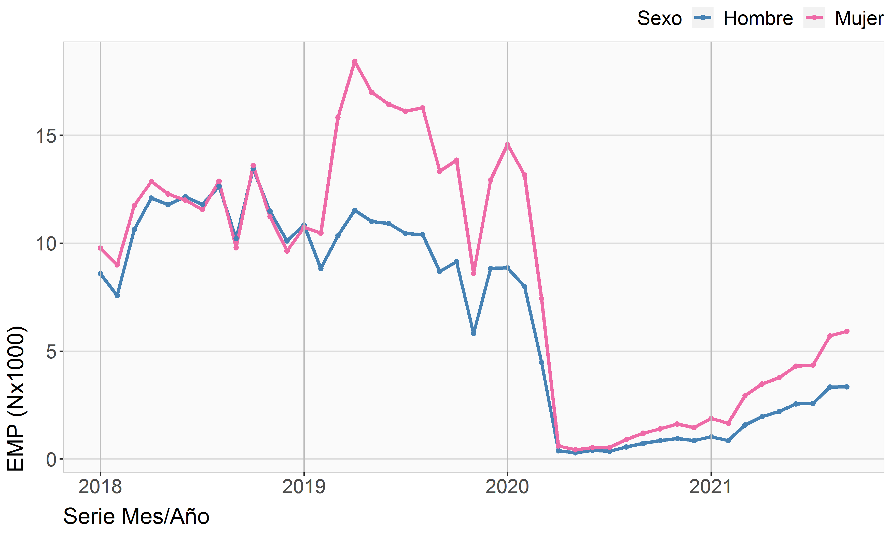
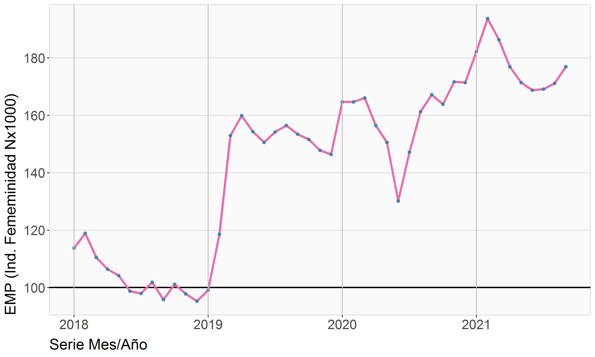
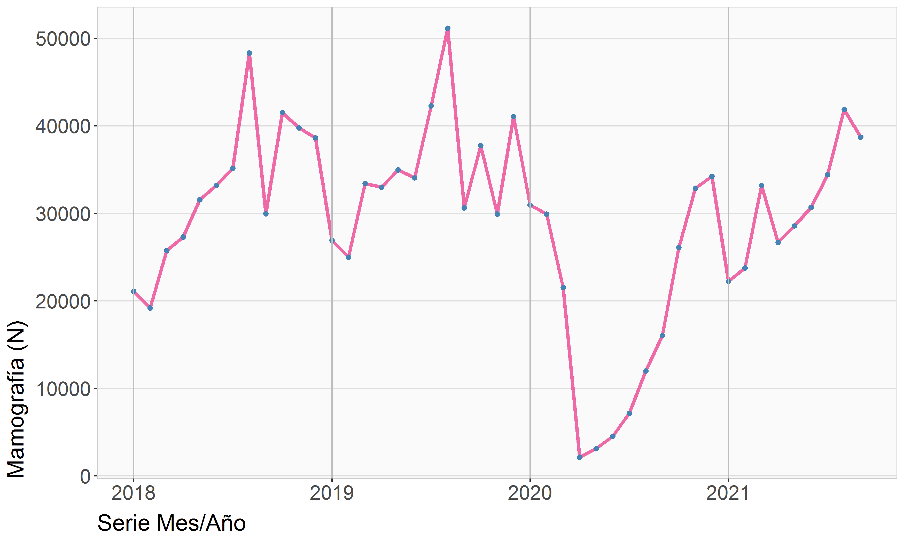
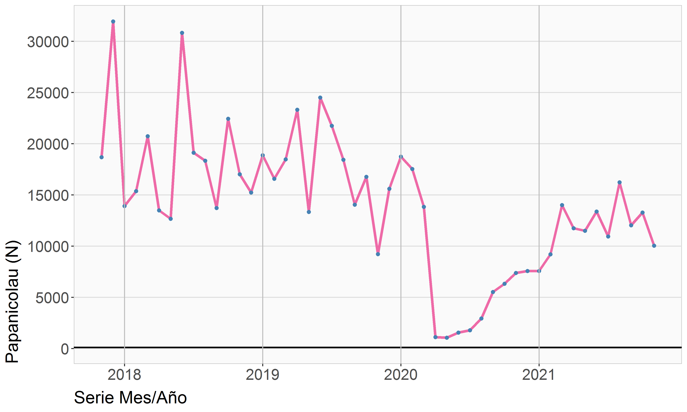

## Medicina preventiva

**Archivos para el PMG de Género 2021**  
Departamento de Estudios y Estadísticas  
División de Desarrollo Institucional  
FONASA 2021© [^1]

----

## Archivos de datos

   

---

## Archivos gráficos

---

[^1]: Elaborado por Oliver Rojas Bustamante, orojas@fonasa.cl
