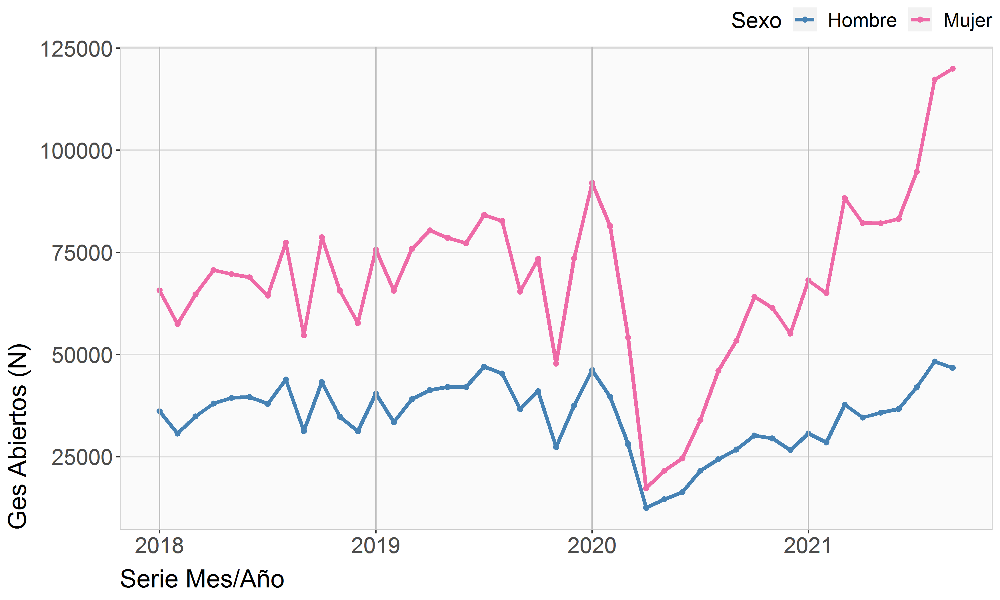
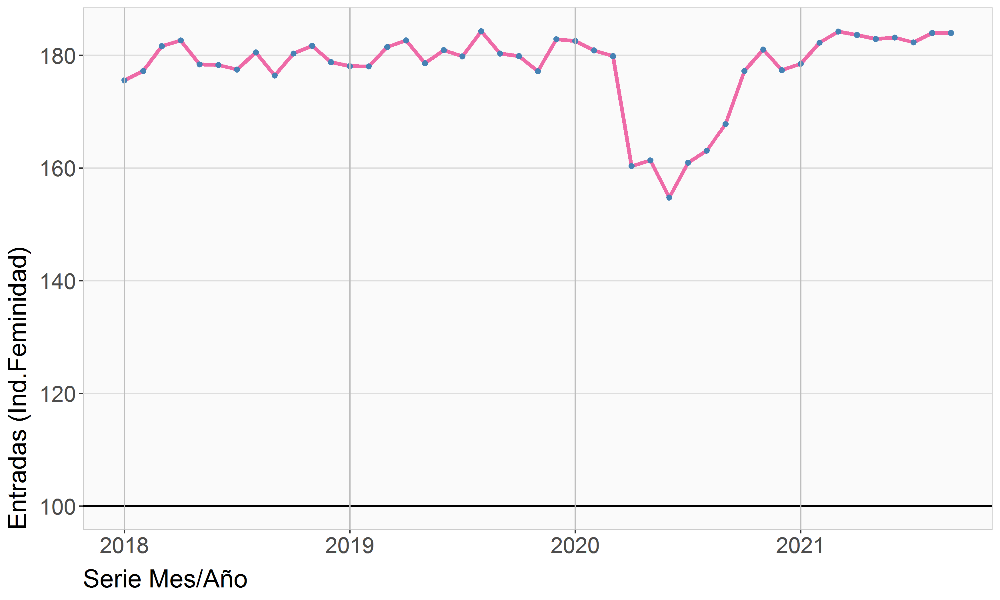

## Ges y No ges

**Archivos para el PMG de Género 2021**  
Departamento de Estudios y Estadísticas  
División de Desarrollo Institucional  
FONASA 2021© [^1]

----

## Archivos de datos

[dataGes](./dataGes.xlsx)   
[dataGesTasa](./dataGesTasa.xlsx)   
[dataPobla](./dataPobla.xlsx)   
[Datos GES PMG genero](./Datos GES PMG genero.xlsx)   

---

## Archivos gráficos

---

[^1]: Elaborado por Oliver Rojas Bustamante, orojas@fonasa.cl
