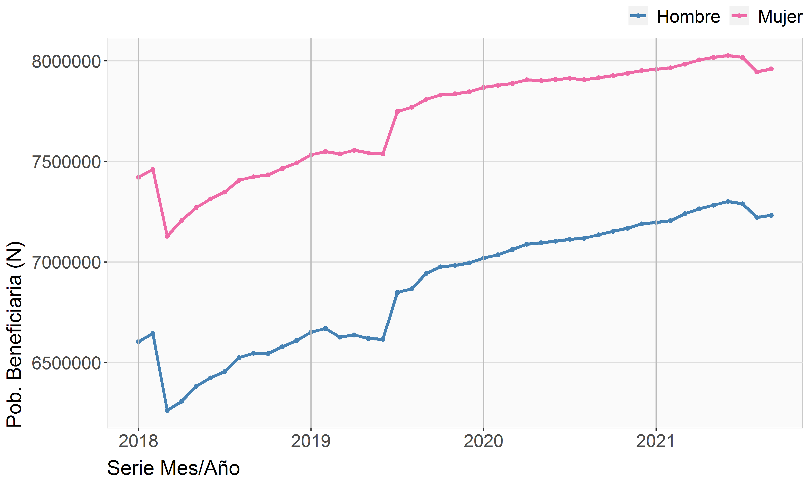
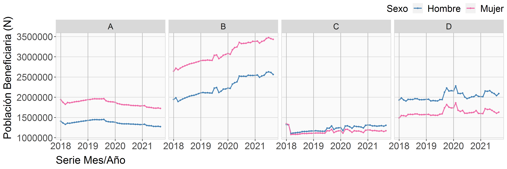

# Como trabajar

de cómo armar un documento público

**Paso 1**   
Escribir en el `readme.md` de qué se trata lo que se va a mostrar usando títulos y parrafos.

**Paso 2**   
A la hora de ingresar una imágen dejarlas en la carpeta `/.img` y usar esta referencia relativa, por ejemplo la imagen **poblaN**. 

> Ojo que la referencia relativa lleva punto `./`

``

Si queda muy grande hay controles para cambiar el tamaño

Puesta la imagen en la carpeta también se puede arrastrar acá y debiera queda bien la referencia.

# Tamaño población Fonasa

Las siguientes imágenes dan muetran.... etc etc.

Etc

