# Instrucciones de Uso

Instrucciones para utilizar el sistema de documentación del departamento de Estudios y Estadísticas. Aquí se detallan los diversos procesos que se ejecutan en el departamento.

## Funcionamiento

A grandes rasgos el sistema funciona de la siguiente forma:

Se usa github como plataforma informática para el almacenamiento de la documentación, esto tiene diversas ventajas respecto de un sistema basado en carpetas compartidas y archivos de Word u otros formatos.

- La visualización se hace en [Github.com]() mediante un navegador Web lo cual agrega sencillez
- Cada persona debe tener un usuario para conectarse y ver el contenido: Dado que el repositorio no es público cada acceso se asocia a una cuenta y esto agrega seguridad.
- Cada cambio realizado queda asociado a una fecha-hora y usuario 
- Se puede revisar versiones antiguas de un documento en cualquier momento y ver las modificaciones que cada usuario haga

**También tiene algunas desventajas**

- Es un sistema que requiere de varios pasos estrictos para que funcione
- Requiere de aprender una nueva tecnología y el uso de 2 programas.


## Instrucciones de uso

Para poder utilizar el sistema se deben seguir los siguientes pasos.

### Paso 1: Crear una cuenta en GitHub

Ir a [github.com](https://github.com/) y hacer clic en **Sign Up**, seguir los pasos. Una vez completado enviar el nombre de usuario a [estadisticas@fonasa.cl](#) para que se habilite el acceso al repositorio.

El usuario queda asociado al nombre registrado, por ejemplo la cuenta en dónde se aloja la documentación es [github.com/Estudios-y-Estadisticas](https://github.com/Estudios-y-Estadisticas) en dónde el nombre de usuario es:

```
Estudios-y-Estadisticas
```

### Paso 2: Instalar Github Desktop

Es necesario instalar el programa **Gihub Desktip** en el computador del usuario para que descargue una copia completa del repositorio que contiene la documentación y pueda interactuar con el respositorio . 

Se puede encontrar en: [https://desktop.github.com/](https://desktop.github.com/)

Una vez instalado hay que registrar nuestra cuenta en el programa, se puede hacer en  
 `Archivo > Opciones`

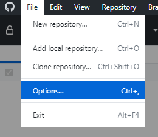

Con el botón **Sign In**

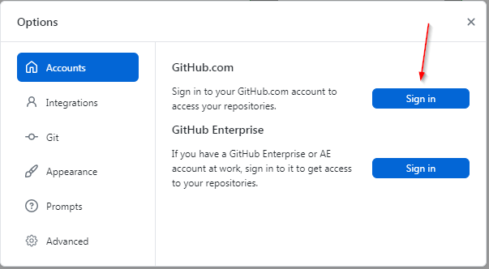

Esto nos devuelve al navegador web para introducir las credenciales de la cuenta.

### Paso 3: Clonar el repositorio

Luego que ya estamos aceptados y conectado como colaboradores en el repositorio de la documentación podemos clonarlo en nuestro computador. Esto lo hacemos en github desktop

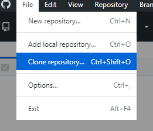


Tenemos que clonar desde la URL https://github.com/Estudios-y-Estadisticas/Documentacion

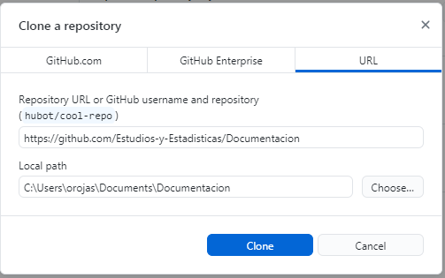

Si vamos a la carpeta `"C:\Users\orojas\Documents\Documentacion"` (en mi caso) veremos que github desktop clonó todo el contenido. **Conviene pegar directamente la ruta a la carpeta porque "Choose..." no siempre funciona**

### Paso 4: Editar o crear documentación

> Antes de crear o editar un archivo del repositorio tenemos que abrir el programa **github desktop** que es el encargado de llevar los controles de versión o cambios realizados a los documentos.
>
> Por mucho que se hagan cambios en los documentos, no se verán reflejados en *github.com* hasta que se ejecute el *Commit* y el *Push* respectivo (se ve más adelante).

Si bien un repositorio puede almacenar cualquier tipo de archivo, los cambios **sólo se registran en archivos de tipo texto plano**, no es necesario que tengan la extensión `.txt` sino que puede ser un script de R, Python, SQL, Markdown, CSV, etc. todos los cuales se almacenan como texto, pero con una extensión diferente a `.txt`.

#### Markdown

La documentación de este sistema será Markdown, que corresponde a archivos de texto plano que tienen un formato interno que permite visualizarlo como si fuera un archivo de Word (o casi).

> **Markdown** es un [lenguaje de marcado ligero](https://es.wikipedia.org/wiki/Lenguajes_de_marcas_ligeros) creado por [John Gruber](https://es.wikipedia.org/w/index.php?title=John_Gruber&action=edit&redlink=1) que trata de conseguir la máxima legibilidad y facilidad de publicación tanto en su forma de entrada como de salida, inspirándose en muchas  convenciones existentes para marcar mensajes de correo electrónico  usando texto plano [de *Wikipedia*]

**Por ejemplo**: en Markdown para hacer las negritas se debe escribir doble asterisco alrededor de la palabra: `**negrita**` que se verá así: **Negrita**

No es necesario escribir todas las veces los asteriscos porque el programa que usaremos permite muchos atajos del teclado o con su interfaz.

#### Typora

Para editar documentos *Markdown* usaremos *Typora*, que se puede encontrar en [https://typora.io](https://typora.io#download) hay que descargar e instalar.

> Antes de comenzar a editar documentos vamos a configurar algo muy importante relativo a las imágenes. Cuando peguemos una imagen en markdown no se guarda junto al archivo como un Word, sino que se almacena en un archivo y se accede a la imagen. Typora lo hace automático y hay que configurar algo para que así sea.

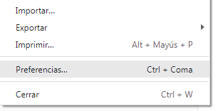

Vamos a `Archivo > Preferencias...` tendremos que dejar la configuración tal cual se ve:

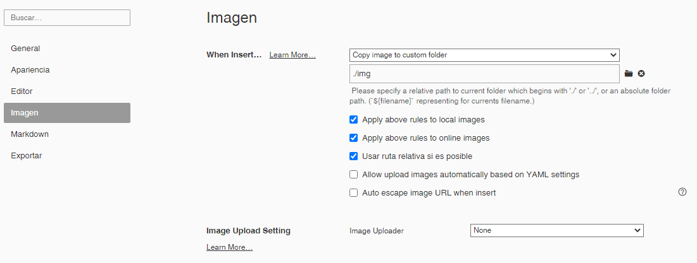

Esto permite que al existir un documento de markdown en un el disco, Typora automáticamente creará la carpeta `./img` y guardará en ese lugar las imágenes que se peguen al documento y las dejará enlazadas.

#### Editar en Markdown

Typora tiene incorporado un manual para consultar cómo aplicar todos los formatos. 

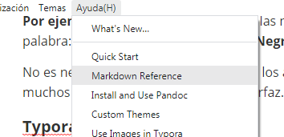

Igual la dejo en el siguiente link: [Markdown Reference](https://github.com/Estudios-y-Estadisticas/Publico/blob/main/Markdown%20Reference.md), espero traducirlo con el tiempo.

De todas formas en menús superiores están las opciones que se desee, por ejemplo algunos elementos de uso común

----

**Negrita**  
CTRL + B

----

**Nota**   
Iniciar el texto con `>`

```
> por ejemplo esto queda como nota
```

> por ejemplo esto queda como nota

---

**Lineas de separación**   
Como estas que se ven, basta con escribir 3 guiones y un enter `---`

---

**Lista con números**   
SI se escribe un número y un punto `1.` al espacio siguiente se crea automático

1. Queda
2. Así

Para salir de la lista hay que apretar enter 2 veces

---

**Lista con viñeta**   
Lo mismo pero con asteristco `*` o guión `-`

- Así 
- Queda
  - Con el tabulador se agrega un nivel

Varios `Enter` para ir saliendo de la lista

---

**Código**   
Hay dos formas de insertar código una forma es `en linea como este segmento` basta con seleccionar o apretar `CTRL + ñ` 

También se puede agregar un bloque de código con `CTRL + K`

```sql
SELECT
	TABLE_OWNER,
	TABLE_NAME,
	PARTITION_NAME,
	SUBSTR(PARTITION_NAME, 6, 10), 
	NUM_ROWS
FROM
	ALL_TAB_PARTITIONS
WHERE
	table_owner = 'OWN_BI_FONASA'
	AND TABLE_NAME = 'TH_DMBEN_PERSONA';
```

Permite agregar el lenguaje utilizado para resaltar algunas palabras clave, en este caso es SQL.

---

Solucionar problemas    
A veces no queda como se desea y hay que editar el código de markdown de forma directa.

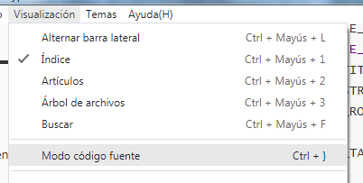

Esto mostrará directamente el código de *Markdown*. En formato código la imagen anterior luce así:

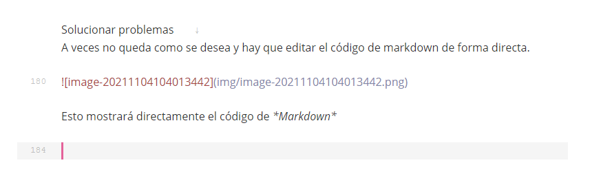

---

**Indice**   
El índice o tabla de contenidos que está al costado izquierdo de *Typora* se puede activar con `CTRL + L` y los títulos se determinan con el signo hash o gato `#` y un espacio

```
# Titulo 1
## Titulo 2
### Titulo 3
... etc
```

---

Y etc. Cualquier consulta hay muchisima ayuda en Internet. 

Por ejemplo este es un diagrama en Mermaid, que github aun no implementa pero en el documento se puede visualizar. (si el proxy lo permite)

~~~sequence
```sequence
Alice->Bob: Hello Bob, how are you?
Note right of Bob: Bob thinks
Bob-->Alice: I am good thanks!
```
~~~


#### Flujo de trabajo

En el día a día lo que hacemos es trabajar en la carpeta local en dónde clonamos el repositorio y vamos actualizando mediante *commit* y *push* el repositorio en Github.

La estructura de la carpeta será la misma que en Github y para hacer links también se debe seguir la misma estructura.

### Paso 5: Commit y Push

Ahora que ya creamos o editamos un documento en *Markdown* hay que subirlo a github. Cuando se edite un documento veremos que esos cambios se registran en **github desktop** con color rojo y con verde si son adiciones.

En la barra lateral se indica si se agregaron modificaron o agregaron archivos. 

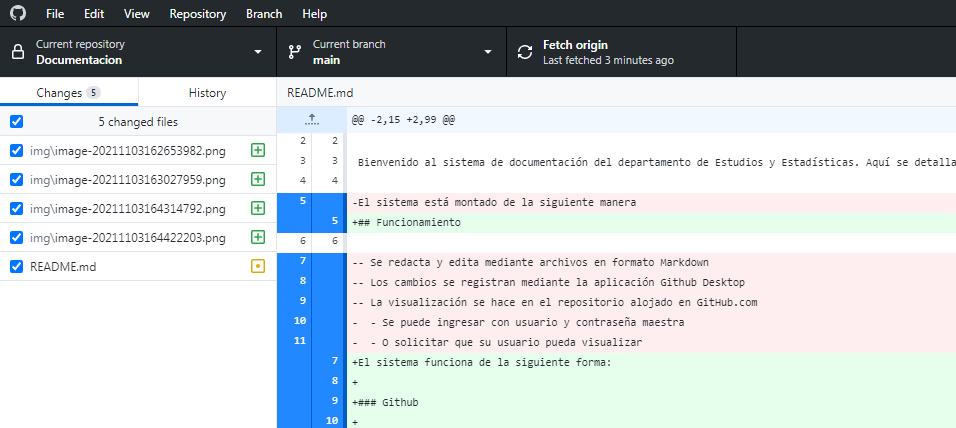

Si ya estamos listos con las ediciones, todo guardado y revisado es hora de ejecutar los procedimientos de control de cambios. Estos son estrictos en su ejecución por el diseño del sistema, así que no se pueden saltar.

#### Commit

Este paso se realiza abajo a la izquierda y consiste en crear un **Título** y un **Comentario** sobre las modificaciones realizadas. Si la edición es pequeña basta con escribir `actualización` o algo así. Pero si son cambios grandes conviene dejar algún detalle.

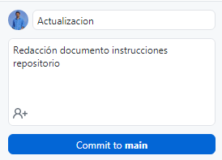

Al hacer el commit, github desktop archivará la existencia de las modificaciones realizadas en el repositorio local.

#### Push

Lo siguiente es enviar nuestro *Commit* (con los cambios) a la linea de edición de Github, con el botón de la imagen de abajo.

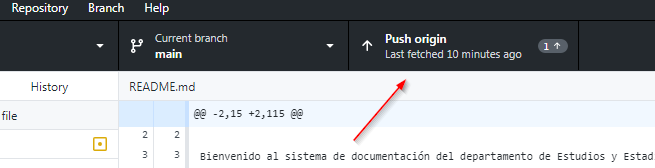

Si fuera necesario o no se hizo el push o algo pasó el boton de **Push orign** estará activado.

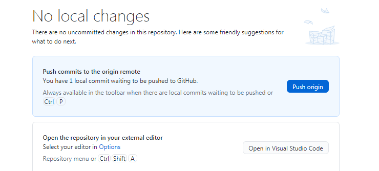

Basta con hacer clic en **Push origin** y los cambios se verán en la página de Github, en dónde podremos acceder a las versiones antiguas seleccionando por **Commit**

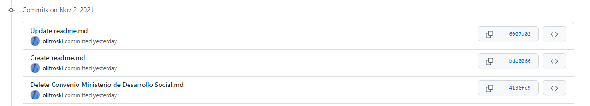


## Notas

A grandes rasgos así funciona un sistema de documentación con control de cambios por usuario con el sistema GIT que usa Github. Si bien puede parecer engorroso en la práctica no los es.

Este es por lejos el sistema más utilizado en el mundo para control de versiones con documentación o desarrollo de código.

Este sistema permite muchas más cosas, estas son las básicas.

