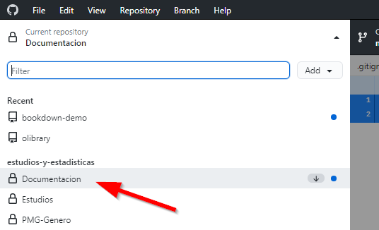
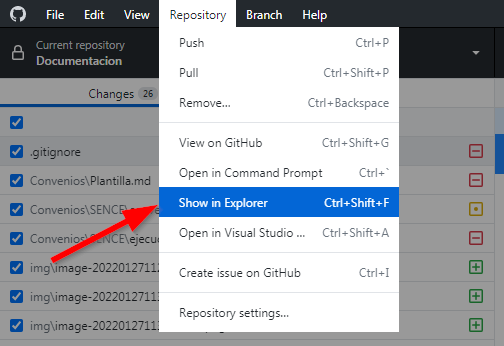
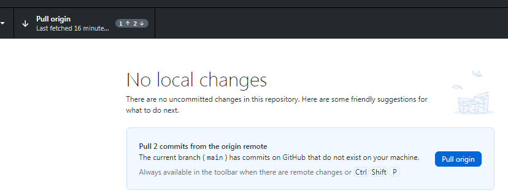

## Flujo de trabajo

Cada vez que vamos a trabajar con este sistema Git vamos a hacer lo siguiente.

> **IMPORTANTE: Recordar que sitio web de Github es *sólo para consulta*, en ese lugar no hacemos nada, todo se hace en el computador en la carpeta que hayamos destinado para tener una copia del respositorio.**

El flujo de trabajo es entonces el siguiente:

### Version corta

1. Abrir Github desktop
2. Sincronizar con `fectch`
3. Trabajar en el directorio local
4. Hacer el `commit` de los cambios
5. Con `push` enviar mi trabajo a Github

### Versión destallada

**1. Abrir Github Destop**: Es deseable que esté abierto el programa siempre que estemos trabajando en el repositorio.

**2. Ubicar el repositorio donde trabajaremos**: Como tenemos varios repositorios tenemos que elegir donde trabajar. Seleccionamos el menú desplegabe

Y luego seleccionamos el respositorio.

**3. Sincronizar archivos**: Ahora toca sincronizar nuestra carpeta con el sitio para tener la última versión en caso que alguien haya realizado cambios, para eso basta con apretar el botón *Fetch*:

Con eso sincronizaremos todo. 

Por ejemplo en mi caso *hay un 2 y una flecha hacia abajo*, esto indica que hay 2 cambios que no tengo actualizados en mi carpeta local y tengo que descargar.

**4. Ir a la carpeta local**: Ahora vamos a la carpeta local para abrir los archivos a editar.

**5. Trabajar**: 

> Ahora trabajar en lo que tengamos que editar o crear.

**6. Registrar mi trabajo**: Ya terminé de trabajar, ahora vuelvo a *Github desktop* para registrar mis cambios con un *commit*. A estas alturas mis trabajo lucirá así:

Para hacer el *commit* se debe ingresar un nombre para lo que se hizo (en este caso es `actualizacion`) y una breve descripción, puede ser algo tan simple como el ejemplo o nada...

**7. Y enviar mi trabajo a Github**: Luego del *commit* hay que volver a apretar el botón fetch o **Pull origin** y listo, todo sincronizado.

