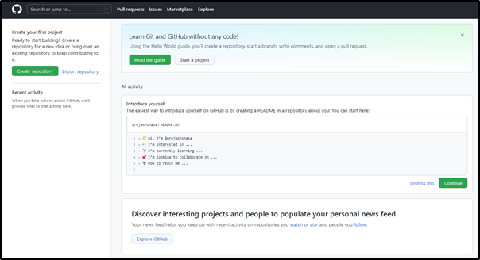
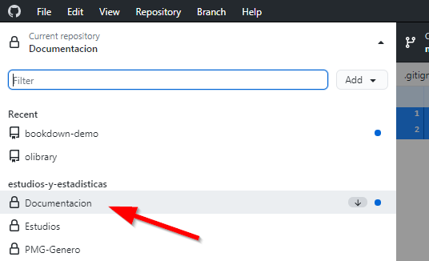
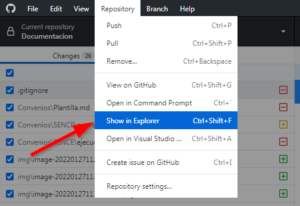
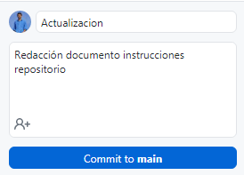

# Manual de uso

Bienvenido al manual para la instalación de todo lo necesario para utilizar sistema de documentación del departamento de Estudios y Estadísticas. 

> Se deben seguir todos los pasos y ante la duda sobre el flujo de trabajo en el trabajo diario ir al siguiente [**documento**](/flujo_trabajo).

## Cuenta de Github

Lo primero es contar con una cuenta personal de Github los pasos son los siguientes, al día de hoy 01.2022 los pasos son los siguientes: 

Ir a [github.com](https://github.com/) y hacer clic en **Sign Up**, 

1. Lo siguiente es ingresar un dirección de correo, si el botón *continue* se vuelve verde se puede seguir
2. Luego ingresar un password. 
3. Luego hay que ingresar un usuario 
4. También pregunta si queremos recibir correos, le decimos que no.
5. Hay que resolver un acertijo para demostrar que somos humanos. 

Terminado este paso se puede crear la cuenta. Ahora tenemos que verificar nuestro correo, en dónde debe llegar un código.

Así se ve el correo

Tiene un botón y un link que se puede usar en lugar de ingresar el código. Independiente de lo que usemos ya estamos listos. Nos pedirá personalizar pero se puede saltar esto haciendo clic en *Skip personalization*

Y por fin tenemos nuestra cuenta que luce así

> **IMPORTANTE**
>
> **El repositorio de documentación es privado y es necesario contar con autorización para verlo.**
>
> **Una vez que tengamos nuestra cuenta creada tenemos que enviar el "nombre de usuario" a [estadisticas@fonasa.cl](#), al otorgar acceso les llegará un correo para validar. En mi caso es "orojasFonasa"**

## Instalar Github Desktop

Para interactuar con Github usaremos el programa Github Desktop, lo podemos encontrar en el siguiente link: 

[https://desktop.github.com/](https://desktop.github.com/)

Una vez instalado hay que registrar nuestra cuenta en el programa, se puede hacer en `Archivo > Opciones`

Con el botón **Sign In**

Esto nos devuelve al navegador web para introducir las credenciales de la cuenta.

## Clonar el repositorio

Ahora vamos a traernos una copia del repositorio de documentación de nuestro PC, pero antes responder **¿qué es un repositorio?**. Para responder hay que explicar cómo funciona Github o cualquier sistema Git en la nube.

> **Github** es una nube, como Onedrive o Dropbox. Tenemos una copia de los datos en la nube de Internet y otra en nuestro computador, para sincronizar lo local (el PC) y lo remoto (Github) tenemos que usar el programa que instalamos recién, por no es automática, es a propósito manual para que cada cambio se registre con fecha y usuario.
>
> En la cuenta de Github se pueden crear carpetas, si estas están en el directorio raiz como sería `C:\` en Windows las carpetas se llaman **repositorios**, cada repositorio es independiente de otro y tiene sus propias reglas, en el caso del respositorio de la documentación es privado y se necesita autorización para editar y ver.
>
> El repositorio inicial donde está este documento es el `repositorio publico`.

Luego que ya estamos aceptados como colaboradores en el repositorio de la documentación podemos clonarlo en nuestro computador. Esto lo hacemos en github desktop.

Tenemos que clonar desde la URL https://github.com/Estudios-y-Estadisticas/Documentacion

Si vamos a la carpeta `"C:\Users\orojas\Documents\Documentacion"` (en mi caso) veremos que github desktop clonó todo el contenido.

## Flujo de trabajo

Cada vez que vamos a trabajar con este sistema Git vamos a hacer lo siguiente.

> **IMPORTANTE: Recordar que sitio web de Github es *sólo para consulta*, en ese lugar no hacemos nada, todo se hace en el computador en la carpeta que hayamos destinado para tener una copia del respositorio.**

El flujo de trabajo es entonces el siguiente:

### Version corta

1. Abrir Github desktop
2. Sincronizar con `fectch`
3. Trabajar en el directorio local
4. Hacer el `commit` de los cambios
5. Con `push` enviar mi trabajo a Github

### Versión destallada

**1. Abrir Github Destop**: Es deseable que esté abierto el programa siempre que estemos trabajando en el repositorio.

**2. Ubicar el repositorio donde trabajaremos**: Como tenemos varios repositorios tenemos que elegir donde trabajar. Seleccionamos el menú desplegabe

Y luego seleccionamos el respositorio.

**3. Sincronizar archivos**: Ahora toca sincronizar nuestra carpeta con el sitio para tener la última versión en caso que alguien haya realizado cambios, para eso basta con apretar el botón *Fetch*:

Con eso sincronizaremos todo. 

Por ejemplo en mi caso *hay un 2 y una flecha hacia abajo*, esto indica que hay 2 cambios que no tengo actualizados en mi carpeta local y tengo que descargar.

**4. Ir a la carpeta local**: Ahora vamos a la carpeta local para abrir los archivos a editar.

**5. Trabajar**: 

> Ahora trabajar en lo que tengamos que editar o crear.

**6. Registrar mi trabajo**: Ya terminé de trabajar, ahora vuelvo a *Github desktop* para registrar mis cambios con un *commit*. A estas alturas mis trabajo lucirá así:

Para hacer el *commit* se debe ingresar un nombre para lo que se hizo (en este caso es `actualizacion`) y una breve descripción, puede ser algo tan simple como el ejemplo o nada...

**7. Y enviar mi trabajo a Github**: Luego del *commit* hay que volver a apretar el botón fetch o **Pull origin** y listo, todo sincronizado.

## Crear o editar documentos

> **Todos los documentos los trabajaremos en formato Markdown**

Ya tenemos claro el flujo de trabajo que vimos recién, si vamos a crear o editar documentos ya sabemos que hay que abrir Github Desktop y sincronizar antes de trabajar, luego nos vamos a la carpeta a trabajar:

Si bien en los repositorios de Github se puede dejar todo tipo de archivos, llevar un control de la documentación requiere que se redacte en un archivo de texto plano, sólo que en este caso en lugar de ser un `.txt` será un archivo de Markdown con extensión `.md`.

Todos los archivos de texto serán objeto de un control de versión en Github, por ejemplo:

- CSV para guardar datos (no muchos porque el espacio es limitado)
- SQL archivos de texto con extensión `.sql` con consultas y procedimientos 
- R y Python, en ambos los script de programación son archivos de texto con extensión `.R` y `.py` respectivamente.
- Markdown, es un archivo de texto con extensión `.md` como este documento que estás leyendo.

### Markdown

**Markdown** es un [lenguaje de marcado ligero](https://es.wikipedia.org/wiki/Lenguajes_de_marcas_ligeros) creado por [John Gruber](https://es.wikipedia.org/w/index.php?title=John_Gruber&action=edit&redlink=1) que trata de conseguir la máxima legibilidad y facilidad de publicación, por ejemplo:

En [ionos.es/digitalguide/paginas-web/desarrollo-web/tutorial-de-markdown/](https://www.ionos.es/digitalguide/paginas-web/desarrollo-web/tutorial-de-markdown/) hay una buena guía para entender el lenguaje, pero para simplificar las cosas usaremos un editor de Markdown que simplifica todo.

### Typora

Para editar documentos usaremos Typora, que se puede encontrar en este [link](/Software/typora-update-x64-1117.exe). Una vez instalado tenemos que configurar el tratamiento de las imágenes, es decir, para que podamos copiar una imagen y pegarla directo al documento o arrastrarla si tenemos un archvio de imagen.

**Configurar las imagenes**

Antes de comenzar a editar documentos vamos a configurar algo muy importante relativo a las imágenes. Cuando peguemos una imagen en markdown no se guarda dentro del archivo como en *Word*, sino que se almacena en un archivo. *Typora* lo hace automático, pero tenemos que configurar lo siguiente:

Ir a las preferencias

En la sección de imágen tenemos que dejar la siguiente configuración. 

Esto permite que al existir un documento de markdown en un el disco, Typora automáticamente creará la carpeta `./img` y guardará en ese lugar las imágenes que se peguen al documento y las dejará enlazadas.

